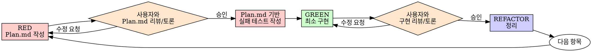
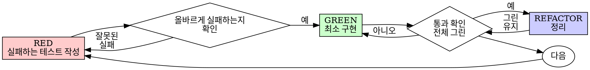

# 테스트 주도 개발 (TDD) — C++ / Visual Studio / GoogleTest

## 개요

테스트를 먼저 작성한다. 실패하는 것을 확인한다. 통과시킬 최소한의 코드를 작성한다.

**핵심 원칙:** 테스트가 실패하는 것을 직접 보지 않았다면, 그 테스트가 올바른 것을 검증하는지 알 수 없다.

**규칙의 문구를 어기는 것은 규칙의 정신을 어기는 것이다.**

## 언제 사용하는가

**항상:**
- 새로운 기능
- 버그 수정
- 리팩터링
- 동작 변경

**예외 (사용자에게 확인 필요):**
- 일회성 프로토타입
- 자동 생성된 코드 (e.g. Protobuf 산출물)
- 빌드/설정 파일

"이번 한 번만 TDD를 건너뛰자"는 생각이 든다면? 멈춰라. 그것은 합리화다.

## RED-GREEN-REVIEW 협업 흐름

이 프로젝트에서는 RED와 GREEN 각 단계 뒤에 **사용자 리뷰 체크포인트**를 둔다. 혼자 끝까지 밀고 나가지 않는다.



**단계별 규칙:**

1. **RED — Plan.md 작성 & 리뷰**
   - 코드나 테스트를 작성하기 전에, 이번에 다룰 항목(어떤 동작을 테스트할지, 예상 API, 엣지 케이스)을 `Plan.md`에 정리한다.
   - 이 Plan.md를 사용자에게 제시하고 리뷰를 받는다. 필요하면 함께 토론하며 내용을 수정한다.
   - **사용자의 승인 없이 다음 단계(실패 테스트 작성)로 넘어가지 않는다.**
   - 승인 후에만 Plan.md 내용을 바탕으로 실제 실패하는 테스트 코드를 작성한다.

2. **RED 검증**은 기존과 동일 (아래 "RED 검증" 절 참고) — 테스트가 올바른 이유로 실패하는지 직접 확인한다.

3. **GREEN — 최소 구현 & 리뷰**
   - 테스트를 통과시키는 최소 구현 코드를 작성한다.
   - 구현이 끝나면 코드를 사용자에게 제시하고 리뷰를 받는다. 필요하면 함께 토론하며 수정한다.
   - **사용자의 승인 없이 REFACTOR나 다음 테스트로 넘어가지 않는다.**

4. **GREEN 검증**은 기존과 동일 — 모든 테스트가 통과하는지 직접 확인한다 (사용자 승인 이전에 이미 통과 상태여야 한다).

5. 승인 후 REFACTOR로 진행하거나 다음 항목의 RED(Plan.md 작성)로 돌아간다.

Plan.md는 매 사이클(각 테스트 항목)마다 갱신/작성하는 살아있는 문서다. 과거 항목 내용을 지우지 말고, 진행 중/완료 상태를 구분해 남겨둔다.

## 절대 법칙

```
실패하는 테스트 없이 프로덕션 코드를 작성하지 말 것
```

테스트보다 코드를 먼저 작성했는가? 삭제하라. 처음부터 다시 시작하라.

**예외 없음:**
- "참고용"으로 보관하지 마라
- 테스트를 작성하면서 그 코드를 "각색"하지 마라
- 그 코드를 보지 마라
- 삭제는 삭제다

테스트로부터 새롭게 구현하라. 끝.

## Red-Green-Refactor



### RED — 실패하는 테스트 작성

**먼저 Plan.md에 이번 테스트가 검증할 동작을 적고 사용자 리뷰를 받는다** (위 "RED-GREEN-REVIEW 협업 흐름" 참고). 승인받은 후에 아래처럼 해야 할 일을 보여주는 최소한의 테스트 하나를 작성한다.

<Good>
```cpp
#include <gtest/gtest.h>
#include "retry_helper.h"

TEST(RetryHelperTest, RetriesFailedOperationsThreeTimes) {
    int attempts = 0;
    auto operation = [&attempts]() -> std::string {
        ++attempts;
        if (attempts < 3) {
            throw std::runtime_error("fail");
        }
        return "success";
    };

    auto result = RetryHelper::Retry<std::string>(operation);

    EXPECT_EQ(result, "success");
    EXPECT_EQ(attempts, 3);
}
```
명확한 이름, 실제 동작 검증, 한 가지만 테스트
</Good>

<Bad>
```cpp
TEST(RetryTest, ItWorks) {
    using ::testing::Return;
    using ::testing::Throw;

    MockOperation mock;
    EXPECT_CALL(mock, Call())
        .WillOnce(Throw(std::runtime_error("e1")))
        .WillOnce(Throw(std::runtime_error("e2")))
        .WillOnce(Return("success"));

    RetryHelper::Retry(mock);
}
```
모호한 이름, 실제 코드가 아닌 mock의 호출 횟수만 검증
</Bad>

**요구사항:**
- 하나의 동작
- 명확한 이름 (`TestSuiteName_BehaviorDescription` 패턴)
- 실제 코드 사용 (불가피하지 않다면 gmock 사용 금지)

### RED 검증 — 실패하는 것을 직접 본다

**필수. 절대 건너뛰지 말 것.**

Visual Studio에서 실행:
- **테스트 탐색기(Test Explorer)** 열기 → 해당 테스트 우클릭 → **선택한 테스트 실행**
- 또는 단축키 `Ctrl+R, T` (커서 위치 테스트 실행)

명령줄에서 실행 (`Developer PowerShell for VS`):
```powershell
ctest -R "RetryHelperTest.RetriesFailedOperationsThreeTimes" --output-on-failure
```

또는 gtest 실행 파일 직접 호출:
```powershell
.\out\build\x64-Debug\tests\my_tests.exe `
    --gtest_filter=RetryHelperTest.RetriesFailedOperationsThreeTimes
```

확인할 것:
- 테스트가 실패하는가 (링커/컴파일 오류가 아닌)
- 실패 메시지가 예상한 그대로인가
- 기능이 없어서 실패하는가 (오타나 헤더 누락이 아닌)

**테스트가 통과한다고?** 이미 존재하는 동작을 테스트하고 있는 것이다. 테스트를 고쳐라.

**테스트가 컴파일/링커 오류를 낸다고?** 오류를 고치고, 올바르게 실패할 때까지 다시 실행하라. 컴파일 실패는 RED가 아니다.

### GREEN — 최소 구현 코드

테스트를 통과시킬 가장 단순한 코드를 작성한다.

<Good>
```cpp
// retry_helper.h
#pragma once
#include <functional>
#include <stdexcept>

namespace RetryHelper {

template <typename T>
T Retry(const std::function<T()>& fn) {
    for (int i = 0; i < 3; ++i) {
        try {
            return fn();
        } catch (const std::exception&) {
            if (i == 2) throw;
        }
    }
    throw std::logic_error("unreachable");
}

}  // namespace RetryHelper
```
통과시킬 만큼만
</Good>

<Bad>
```cpp
template <typename T>
T Retry(
    const std::function<T()>& fn,
    int max_retries,
    BackoffStrategy backoff,
    std::function<void(int)> on_retry,
    std::function<bool(const std::exception&)> retry_predicate
);
```
과도한 설계 — YAGNI
</Bad>

기능을 추가하지 마라, 다른 코드를 리팩터링하지 마라, 테스트가 요구하는 것 이상으로 "개선"하지 마라.

**GREEN 검증까지 마쳤다면, REFACTOR나 다음 테스트로 넘어가기 전에 구현 코드를 사용자에게 제시하고 리뷰/토론을 거친다** (위 "RED-GREEN-REVIEW 협업 흐름" 참고).

### GREEN 검증 — 통과하는 것을 직접 본다

**필수.**

Visual Studio 테스트 탐색기에서 다시 실행하거나:
```powershell
ctest -R "RetryHelperTest.RetriesFailedOperationsThreeTimes" --output-on-failure
```

전체 테스트 회귀 확인:
```powershell
ctest --output-on-failure
```

확인할 것:
- 테스트가 통과하는가
- 다른 테스트도 여전히 통과하는가
- 출력이 깨끗한가 (경고, sanitizer 보고서, 메모리 누수 없음)

**테스트가 실패한다고?** 코드를 고쳐라. 테스트가 아니다.

**다른 테스트가 깨졌다고?** 지금 고쳐라.

### REFACTOR — 정리

그린 상태에서만:
- 중복 제거
- 이름 개선
- 헬퍼 / free function 추출
- `const` / `noexcept` / `[[nodiscard]]` 적용
- 헤더-구현 분리 정리

테스트는 계속 그린 상태로 유지한다. 동작을 추가하지 않는다.

### 반복

다음 기능에 대한 다음 실패 테스트로 넘어간다.

## 좋은 테스트

| 품질 | 좋음 | 나쁨 |
|------|------|------|
| **최소** | 한 가지만. 이름에 `And`가 있나? 분리하라. | `ValidatesEmailAndDomainAndWhitespace` |
| **명확** | 이름이 동작을 설명한다 | `Test1`, `BasicTest` |
| **의도 표현** | 원하는 API를 보여준다 | 코드가 어떻게 동작해야 하는지 흐려놓는다 |

GoogleTest 명명 규칙을 활용하라:
```cpp
TEST(SuiteName, BehaviorDescriptionInPascalCase) { ... }
TEST_F(FixtureName, ThrowsWhenInputIsEmpty) { ... }
```

## 순서가 중요한 이유

**"코드 작성 후 테스트로 검증하면 되지 않나"**

코드 작성 후 작성한 테스트는 즉시 통과한다. 즉시 통과하는 것은 아무것도 증명하지 않는다:
- 잘못된 것을 테스트했을 수 있다
- 동작이 아닌 구현(특정 메모리 레이아웃, 특정 알고리즘 단계)을 테스트했을 수 있다
- 잊어버린 엣지 케이스(빈 입력, 오버플로우, nullptr)를 놓쳤을 수 있다
- 그 테스트가 실제로 버그를 잡는 것을 본 적이 없다

테스트 우선은 테스트가 실패하는 것을 직접 보게 만들어, 실제로 무언가를 검증한다는 사실을 증명한다.

**"엣지 케이스는 이미 디버거로 다 확인했다"**

수동 디버깅은 즉흥적이다. 모두 테스트했다고 생각하지만:
- 무엇을 확인했는지 기록이 없다
- 코드가 변경되면 다시 실행할 수 없다
- 압박 상황에서는 케이스를 잊기 쉽다
- "Release 빌드에서 시도했을 때는 됐다" ≠ 포괄적

자동 테스트는 체계적이다. CI에서 매번 동일하게 실행된다.

**"X시간의 작업을 지우는 것은 낭비다"**

매몰비용 오류다. 그 시간은 이미 지나갔다. 지금의 선택지:
- 삭제하고 TDD로 재작성 (X시간 추가, 높은 신뢰도)
- 그대로 두고 사후 테스트 추가 (30분, 낮은 신뢰도, UB 가능성 높음)

"낭비"는 신뢰할 수 없는 코드를 그대로 두는 것이다. 진짜 테스트가 없는 동작 코드는 기술 부채다 (특히 C++에서는 미정의 동작이 숨어있을 수 있다).

**"TDD는 교조적이다, 실용주의는 적응하는 것이다"**

TDD가 곧 실용적이다:
- 커밋 전에 버그를 찾는다 (사후 디버깅보다 빠르다)
- 회귀를 방지한다 (테스트가 즉시 깨짐을 잡아낸다)
- 동작을 문서화한다 (테스트가 사용법을 보여준다)
- 리팩터링을 가능하게 한다 (자유롭게 변경, 테스트가 깨짐을 잡는다)

"실용적인" 지름길 = 운영 환경 디버깅 = 더 느려진다. C++에서는 운영 환경 크래시 = 코어 덤프 분석 = 훨씬 더 느려진다.

**"사후 테스트도 같은 목표를 달성한다 — 형식이 아닌 정신이다"**

아니다. 사후 테스트는 "이 코드가 무엇을 하는가?"에 답한다. 우선 테스트는 "이 코드가 무엇을 해야 하는가?"에 답한다.

사후 테스트는 당신의 구현에 편향된다. 요구사항이 아닌 만든 것을 테스트한다. 발견한 엣지 케이스가 아닌 기억나는 엣지 케이스를 검증한다.

우선 테스트는 구현 전에 엣지 케이스 발견을 강제한다. 사후 테스트는 모든 것을 기억했는지 검증할 뿐이다 (기억하지 못한다).

사후 30분의 테스트 ≠ TDD. 커버리지는 얻지만 테스트가 작동한다는 증명은 잃는다.

## 흔한 합리화

| 변명 | 현실 |
|------|------|
| "테스트하기엔 너무 단순하다" | 단순한 코드도 깨진다. 테스트는 30초면 된다. |
| "나중에 테스트하겠다" | 즉시 통과하는 테스트는 아무것도 증명하지 않는다. |
| "사후 테스트도 같은 목표를 달성한다" | 사후 = "이 코드가 무엇을 하는가?", 우선 = "무엇을 해야 하는가?" |
| "이미 디버거로 확인했다" | 즉흥적 ≠ 체계적. 기록이 없고, 다시 실행할 수 없다. |
| "X시간을 지우는 것은 낭비" | 매몰비용 오류. 검증되지 않은 코드를 두는 것이 기술 부채다. |
| "참고용으로 두고 테스트 먼저 작성한다" | 그것을 각색하게 된다. 그건 사후 테스트다. 삭제는 삭제다. |
| "먼저 탐색해야 한다" | 좋다. 탐색 코드는 버리고, TDD로 시작하라. |
| "테스트하기 어렵다 = 설계가 불명확하다" | 테스트의 말을 들어라. 테스트하기 어려우면 사용하기도 어렵다. |
| "TDD는 나를 느리게 한다" | TDD는 디버깅보다 빠르다. 실용적 = 테스트 우선. |
| "수동 테스트가 더 빠르다" | 수동은 엣지 케이스를 증명하지 않는다. 변경할 때마다 재테스트해야 한다. |
| "기존 코드에 테스트가 없다" | 당신이 그것을 개선하는 중이다. 기존 코드에도 테스트를 추가하라. |
| "템플릿이라 테스트가 어렵다" | 명시적 인스턴스화로 테스트 가능. 어려우면 설계가 잘못된 것. |

## 위험 신호 — 멈추고 처음부터 다시 시작

- 테스트보다 먼저 작성된 코드
- 구현 후 작성된 테스트
- 테스트가 즉시 통과
- 테스트가 왜 실패했는지 설명할 수 없음
- 테스트를 "나중에" 추가
- "이번 한 번만"이라는 합리화
- "이미 디버거로 확인했다"
- "사후 테스트도 같은 목적을 달성한다"
- "형식이 아니라 정신이다"
- "참고용으로 두자" 또는 "기존 코드를 각색하자"
- "이미 X시간 썼는데 지우는 건 낭비다"
- "TDD는 교조적이다, 나는 실용적이다"
- "이건 다르다, 왜냐하면…"

**이 모든 것의 의미: 코드를 삭제하라. TDD로 처음부터 다시 시작하라.**

## 예시: 버그 수정

**버그:** 빈 이메일이 허용됨

**RED**
```cpp
#include <gtest/gtest.h>
#include "form_service.h"

TEST(FormServiceTest, RejectsEmptyEmail) {
    FormData data{ /*email=*/"" };

    auto result = FormService::SubmitForm(data);

    EXPECT_FALSE(result.ok);
    EXPECT_EQ(result.error, "Email required");
}
```

**RED 검증** (Test Explorer 또는 명령줄)
```text
[ RUN      ] FormServiceTest.RejectsEmptyEmail
form_service_test.cpp(8): error: Expected equality of these values:
  result.error
    Which is: ""
  "Email required"
[  FAILED  ] FormServiceTest.RejectsEmptyEmail
```

**GREEN**
```cpp
// form_service.cpp
#include "form_service.h"
#include <algorithm>
#include <cctype>

namespace FormService {

namespace {
bool IsBlank(const std::string& s) {
    return std::all_of(s.begin(), s.end(),
        [](unsigned char c) { return std::isspace(c); });
}
}  // namespace

Result SubmitForm(const FormData& data) {
    if (data.email.empty() || IsBlank(data.email)) {
        return Result{ /*ok=*/false, /*error=*/"Email required" };
    }
    // ...
    return Result{ /*ok=*/true, /*error=*/"" };
}

}  // namespace FormService
```

**GREEN 검증**
```text
[ RUN      ] FormServiceTest.RejectsEmptyEmail
[       OK ] FormServiceTest.RejectsEmptyEmail (0 ms)
[==========] 1 test passed.
```

**REFACTOR**
필드가 여러 개라면 검증 로직을 별도 함수로 추출한다.

## gmock 사용 시 (불가피한 경우)

외부 의존성(파일 시스템, 네트워크, 시간)이 있을 때만 mock을 사용한다.

```cpp
#include <gmock/gmock.h>

class IClock {
public:
    virtual ~IClock() = default;
    virtual std::chrono::system_clock::time_point Now() const = 0;
};

class MockClock : public IClock {
public:
    MOCK_METHOD(std::chrono::system_clock::time_point, Now, (), (const, override));
};

TEST(TokenTest, ExpiresAfterOneHour) {
    using ::testing::Return;
    MockClock clock;
    auto t0 = std::chrono::system_clock::now();
    EXPECT_CALL(clock, Now())
        .WillOnce(Return(t0))
        .WillOnce(Return(t0 + std::chrono::hours(1) + std::chrono::seconds(1)));

    Token token = TokenFactory::Create(clock);

    EXPECT_TRUE(token.IsValid(clock));
    EXPECT_FALSE(token.IsValid(clock));  // 1시간 1초 경과 후
}
```

mock으로 클래스를 도배하지 마라. 의존성이 자연스럽게 주입되도록 설계가 안 되어 있다면, mock이 아니라 설계를 고쳐라.

## Visual Studio / CMake / GoogleTest 실용 명령어

```powershell
# 빌드 (Developer PowerShell for VS)
cmake --build out\build\x64-Debug

# 전체 테스트
ctest --test-dir out\build\x64-Debug --output-on-failure

# 특정 suite 또는 테스트만
ctest --test-dir out\build\x64-Debug -R "RetryHelperTest.*" --output-on-failure

# 실패한 테스트만 다시 실행
ctest --test-dir out\build\x64-Debug --rerun-failed --output-on-failure

# gtest 실행 파일 직접 호출 (더 빠른 피드백)
.\out\build\x64-Debug\tests\my_tests.exe --gtest_filter=RetryHelperTest.*
.\out\build\x64-Debug\tests\my_tests.exe --gtest_list_tests
.\out\build\x64-Debug\tests\my_tests.exe --gtest_repeat=10 --gtest_break_on_failure
```

`CMakeLists.txt` 최소 설정 예시:

```cmake
include(FetchContent)
FetchContent_Declare(
    googletest
    URL https://github.com/google/googletest/archive/refs/tags/v1.14.0.zip
)
FetchContent_MakeAvailable(googletest)

enable_testing()

add_executable(my_tests
    tests/retry_helper_test.cpp
    tests/form_service_test.cpp
)

target_link_libraries(my_tests
    PRIVATE
        my_lib
        GTest::gtest_main
        GTest::gmock
)

include(GoogleTest)
gtest_discover_tests(my_tests)
```

Visual Studio에서:
- **테스트 → 테스트 탐색기** (단축키 `Ctrl+E, T`)
- **테스트 → 디버그 → 모든 테스트 실행** (디버거에서 실행하면 첫 실패 지점에서 중단)
- **빌드 → 빌드 후 테스트 실행** 옵션 활성화 가능

## 검증 체크리스트

작업을 완료로 표시하기 전에:

- [ ] 모든 새 함수/메서드/클래스에 테스트가 있다
- [ ] 각 테스트가 구현 전에 실패하는 것을 직접 보았다
- [ ] 각 테스트가 예상한 이유로 실패했다 (오타/헤더 누락이 아닌 기능 부재)
- [ ] 각 테스트를 통과시킬 최소 코드를 작성했다
- [ ] 모든 테스트가 통과한다 (`ctest --output-on-failure`)
- [ ] 출력이 깨끗하다 (컴파일러 경고, ASan/UBSan 보고서 없음)
- [ ] 테스트가 실제 코드를 사용한다 (mock은 불가피한 경우만)
- [ ] 엣지 케이스, 오류 경로, 자원 해제(RAII) 경로가 다뤄졌다

모두 체크할 수 없다면? TDD를 건너뛴 것이다. 처음부터 다시 시작하라.

## 막힐 때

| 문제 | 해결 |
|------|------|
| 어떻게 테스트할지 모르겠다 | 원하는 API를 먼저 적어보라. `EXPECT_*`부터 작성하라. 사용자에게 물어보라. |
| 테스트가 너무 복잡하다 | 설계가 너무 복잡하다. 인터페이스를 단순화하라. |
| 모든 것을 mock해야 한다 | 코드가 너무 결합되어 있다. 인터페이스 + 의존성 주입을 사용하라. |
| 테스트 셋업이 너무 크다 | `TEST_F`로 fixture를 만들거나 헬퍼를 추출하라. 그래도 복잡하면 설계를 단순화하라. |
| 정적/싱글턴 때문에 테스트 어려움 | 정적 상태를 인스턴스 멤버로 옮기고 주입하라. |
| 템플릿/헤더 전용 코드 테스트 | `TYPED_TEST` 또는 명시적 인스턴스화 사용. |

## 디버깅과의 통합

버그를 발견했나? 이를 재현하는 실패 테스트를 작성하라. TDD 사이클을 따른다. 테스트가 수정을 증명하고 회귀를 방지한다.

테스트 없이 버그를 고치지 마라. 특히 C++에서 미정의 동작, 자원 누수, race condition은 테스트 없이는 잡기 어렵다.

가능하면 Debug 빌드에서 ASan/UBSan을 켜고 테스트를 실행하라:
- Visual Studio: 프로젝트 속성 → C/C++ → 일반 → **AddressSanitizer 사용** = 예
- 또는 `/fsanitize=address` 컴파일러 옵션

## 테스트 안티패턴

mock이나 테스트 유틸리티를 추가할 때, 흔한 함정을 피하기 위해 점검하라:
- 실제 동작이 아닌 mock의 동작을 테스트하기
- 프로덕션 클래스에 테스트 전용 `friend` 추가하기
- 의존성을 이해하지 않고 mock하기
- `EXPECT_CALL`로 호출 횟수만 검증하고 결과는 검증하지 않기
- private 멤버를 테스트하기 위해 캡슐화 깨기

GoogleTest에서 추가로 유용한 것들:
- `TEST_F` — 공통 셋업이 필요한 fixture 기반 테스트
- `TEST_P` / `INSTANTIATE_TEST_SUITE_P` — 같은 동작을 여러 입력으로 검증하는 파라미터화된 테스트
- `TYPED_TEST` — 여러 타입에 대해 같은 동작 검증
- `EXPECT_THROW(expr, ExceptionType)` — 예외 동작 검증
- `EXPECT_DEATH` — 단언/abort 시나리오 검증
- `SCOPED_TRACE` — 헬퍼 함수에서의 실패 위치 명확화

## 최종 규칙

```
프로덕션 코드 → 먼저 실패한 테스트가 존재한다
그렇지 않으면 → TDD가 아니다
```

사용자의 명시적인 허락 없이는 예외 없음.
